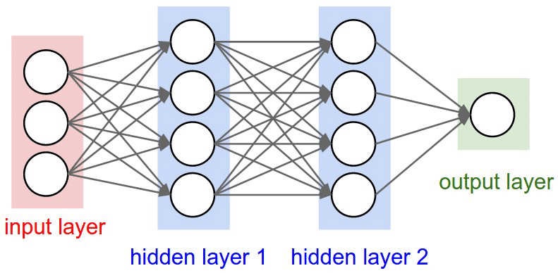

[My-Tensorflow](https://github.com/AhmedKhaled8/My-Tensorflow) is a repository that contains some projects I have done through the journery of learning TensorFlow/Keras and some code-snippets-based notes about some of the fundementals of using TensorFlow.

**List of Contents**
- [0. Projects](#0-projects)
- [1. Hello TensorFlow](#1-hello-tensorflow)
  - [1.1. Importing Libraries](#11-importing-libraries)
  - [1.2. Creating a Model](#12-creating-a-model)
  - [1.3. Defining a Dense Layer](#13-defining-a-dense-layer)
  - [1.4. Adding a Dense Layer into the Model](#14-adding-a-dense-layer-into-the-model)
  - [1.5. Adding Multiple Dense Layers into the Model](#15-adding-multiple-dense-layers-into-the-model)
  - [1.6. Defining a Convolutional Layer (2D)](#16-defining-a-convolutional-layer-2d)
  - [1.7. Defining a Pooling Layer (2D)](#17-defining-a-pooling-layer-2d)
  - [1.8. Add Convoulutional and Pooling Layers to the Model](#18-add-convoulutional-and-pooling-layers-to-the-model)
- [2. Compiling and Fitting the Model](#2-compiling-and-fitting-the-model)
  - [2.1. Defining the Loss and Optimizer Functions](#21-defining-the-loss-and-optimizer-functions)
  - [2.2. Training the Model](#22-training-the-model)
  - [2.3. Evaluate the Model](#23-evaluate-the-model)
  - [2.4. Predicting Using New Data](#24-predicting-using-new-data)
  - [2.5. Callback for Early Stopping](#25-callback-for-early-stopping)
- [3. ImageDataGenerator](#3-imagedatagenerator)
  - [3.1. Creating the Training and Test Images Using ImageDataGenerator](#31-creating-the-training-and-test-images-using-imagedatagenerator)
  - [3.2. Training the ConvNet with ImageGenerator](#32-training-the-convnet-with-imagegenerator)
  - [3.3. Testing the Model by Uploading Images in Colab](#33-testing-the-model-by-uploading-images-in-colab)


## 0. Projects
Here you will find my notebooks about tensorflow that I worked on either on Coursera, Kaggle, projects, etc.

1. [MNIST Fashion Items classification using TensorFlow-Keras](https://github.com/AhmedKhaled8/Tensorflow/blob/main/Fashion_MNIST_Classification.ipynb)

## 1. Hello TensorFlow

### 1.1. Importing Libraries

```python
import tensorflow as tf
from tensorflow import keras
```

### 1.2. Creating a Model

```python
model = tf.keras.Sequential('list of all layers')
```

### 1.3. Defining a Dense Layer

```python
keras.layers.Dense(units='number of neurons', input_shape='shape of the input array/tensor', activation='activation function')
```

### 1.4. Adding a Dense Layer into the Model

```python
model = tf.keras.Sequential([keras.layers.Dense(units=1, input_shape=[1])])
```

This defines a model of a single dense layer that has one neuron/unit and recieves an array of shape 1 (a single number).

### 1.5. Adding Multiple Dense Layers into the Model

To create the network illustrated in the picture below,

<center>

</center>

```python
model = tf.keras.Sequential([
    tf.keras.layers.Dense(units=4, activation='relu', input_shape=(3,)),
    tf.keras.layers.Dense(units=4, activation='relu'),
    tf.keras.layers.Dense(units=1, activation='sigmoid')
])
```

### 1.6. Defining a Convolutional Layer (2D)

```python
tf.keras.layers.Conv2D(filters='no. of filter', kernel_size='shape of the filters', activation='activation function')
```

For example, a convolutional layer with 32 filters each is 3*3 with ReLU activation is implemented this way:

```python
tf.keras.layers.Conv2D(filters=32, kernel_size=(3, 3), activation='relu')
```

It's better to define the shape of the input in the first conv layer using `input_shape` which is 3D (height, width, no. of channels).
```python
tf.keras.layers.Conv2D(filters=32, kernel_size=(3, 3), activation='relu', input_shape=(32, 32, 3))
```

**NOTE:** When using CNN, we need to make sure that our input training images shape is 4-dimensional (no. of images, width, height, no. of channels)

```python
training_images = training_images.reshape(-1, 28, 28, 1)
test_images = test_images.reshape(-1, 28, 28, 1)
```

### 1.7. Defining a Pooling Layer (2D)

```python
tf.keras.layers.MaxPooling2D(pool_size='pooling size') 
# If we want to use the avearge pooling we use AveragePooling2D instead
```

### 1.8. Add Convoulutional and Pooling Layers to the Model

To create this network,
<center>

</center>

```python
model = tf.keras.Sequential([
    tf.keras.layers.Conv2D(filters=32, kernel_size=(5, 5), activation='relu', input_shape=(28, 28, 1)),
    tf.keras.layers.MaxPooling2D(pool_size=(2, 2)),
    tf.keras.layers.Conv2D(filters=64, kernel_size=(5, 5), activation='relu'),
    tf.keras.layers.MaxPooling2D(pool_size=(2, 2)),
    tf.keras.layers.Flatten(),
    tf.keras.layers.Dense(units=1000, activation='relu'),
    tf.keras.layers.Dense(units=10, activation='softmax')
])
```

## 2. Compiling and Fitting the Model

### 2.1. Defining the Loss and Optimizer Functions

To define the loss function and optimizer function, we use the `compile` method in our `model`.

To know the loss amd optimizer, refer to:
* [How to Choose Loss Functions When Training Deep Learning Neural Networks](https://machinelearningmastery.com/how-to-choose-loss-functions-when-training-deep-learning-neural-networks/)

* [Quick Notes on How to choose Optimizer In Keras](https://www.dlology.com/blog/quick-notes-on-how-to-choose-optimizer-in-keras/)

```python
model.compile(optimizer='sgd', loss='mean_squared_error', metrics=['accuracy'])
```

### 2.2. Training the Model

To train the model on our data, we use the `fit` method in our `model`.

```python
model.fit(training_set, training_labels, epochs=50, batch_size=32)
```

To get the history of training, we just take the return dictionary of the `fit` function.

```python
history = model.fit(training_set, training_labels, epochs=50, batch_size=32)


# summarize history for accuracy
import matplot.pyplot as plt
plt.plot(history.history['accuracy'])
plt.plot(history.history['val_accuracy'])
plt.title('model accuracy')
plt.ylabel('accuracy')
plt.xlabel('epoch')
plt.legend(['train', 'test'], loc='upper left')
plt.show()
```

### 2.3. Evaluate the Model

```python
model.evaluate(test_set, test_labels)
```

### 2.4. Predicting Using New Data

To predict the outcome of our model, we use `predict` method in our `model`.

```python
model.predict([10.0])
```

### 2.5. Callback for Early Stopping

To create a callback that checks the accuracy of our model after the end of each epoch, we construct a new class and override the `on_epoch_end` and specify a condition for the accuracy and if it was true, then we set the `stop_training` to `True`.

```python
class EarlyStopping(tf.keras.callbacks.Callback):
    def on_epoch_end(self, epoch, logs={}):
        if logs.get('accuracy') >= 0.9:
            print(f"\n[EARLY STOPPING] Accuracy above 90% at the end of epoch {epoch}")
            self.model.stop_training = True


early_stopping = EarlyStopping()
model.fit(training_images, test_images, epochs=20, batch_size=32, callbacks=[early_stopping])
```

## 3. ImageDataGenerator

### 3.1. Creating the Training and Test Images Using ImageDataGenerator


Suppose our directory is the following:

```
Images
|
|_ Training
|          |_ Horses
|          |         |
|          |         |_ Horse_1.jpg
|          |         |_ Horse_2.jpg
|          |         |_ horse5.jpg
|          |_ Humans |
|                    |_ Human_2.jpg
|                    |_ Human_6.jpg
|                     |_ girl11.jpg
|_ Validation
           |_ Horses
           |         |
           |         |_ Horse_9.jpg
           |         |_ Horse_10.jpg
           |         |_ horse_val_1.jpg
           |_ Humans |
                     |_ Human_val_34.jpg
                     |_ boy1.jpg
                     |_ girl3.jpg
```

We can process each image in each subdirectory in both training and validation directories and assign each image to a class (horse/human) and to a set (trainin/test) using pure Python and some packages like os and numpy. An easier approach if we use the `ImageDataGenerator`

```python
from tensorflow.keras.preprocessing.image import ImageDataGenerator

train_data_generator = ImageDataGenerator(rescale=1./255) # Create an instance of the ImageDataGenerator for the training images


train_generator = train_data_generator.flow_from_directory(
    train_dir, # the path of the training images directory (Here it's Images/Training not Training/Horses neither Training/Humans neither Images)
    target_size=(300, 300), # the shape to which all images, in the training images, will be reshaped. The shape of the images entering the DNN must be uniformed
    batch_size=128, # the size of the batches of images that will be processed instead of being processed one by one
    class_mode='binary' # If the number of classes is 2, then it's a binary classification
) # assigning the 'Training' directory to the generator and define some parameters

# We will do the same for the validation generator

validation_data_generator = ImageDataGenerator(rescale=1./255)

validation_generator = validation_data_generator.flow_from_directory(
    validation_dir,
    target_size=(300, 300),
    batch_size=32,
    class_mode='binary'
)
```

### 3.2. Training the ConvNet with ImageGenerator

For our example, Horses vs Humans, the classification is binary. So, we will use a loss function that is useful for this type of classifications. A well-known loss function is the `binary_crossentropy`.

```python

model.compile(loss='binary_crossentropy', optimizer='adam', metrics=['accuracy'])

```

When fitting a data that was generated using ImageDataGenerator we use the same `fit` method of `model`.
**NOTE:** `fit_generator` is deprecated.

```python
history = model.fit(
    train_generator, # the generator object for the training images
    steps_per_epoch=8, # the number of batches were required to load all the images in the training directory (1024 images / 128 batch size = 8 bathces)
    epochs=15, # the number of passings through all training images
    validation_data=validation_generator, # the validation generator that will be used to evaluate the training through each step
    validation_steps=8, # the same as steps_per_epoch
    verbose=2, # a parameter that specify some properties of the printed output during training
)
```

### 3.3. Testing the Model by Uploading Images in Colab

```python

import numpy as np
from google.colab import files
from keras.preprocessing.image import load_img, img_to_array

uploaded = files.upload() # This generate a GUI inline in colab to allow you to select images from your device

for fn in uploaded.keys(): # iterate on all paths selected (one or more than one)
    path = '/content/' + fn
    img = load_img(path, target_size=(300, 300))
    img_array = img_to_array(img)
    images = np.vstack([img_array]) # This ensures that the shape of images is 4D (300, 300, 3) --> (1, 300, 300, 3)
    classes = model.predict(images, batch_size=10)
    print(classes[0])
    if classes[0] > 0.5:
        print(fn + " is a human") # human is class 1
    else:
        print(fn + " is a horse") # horse is class 0

```
